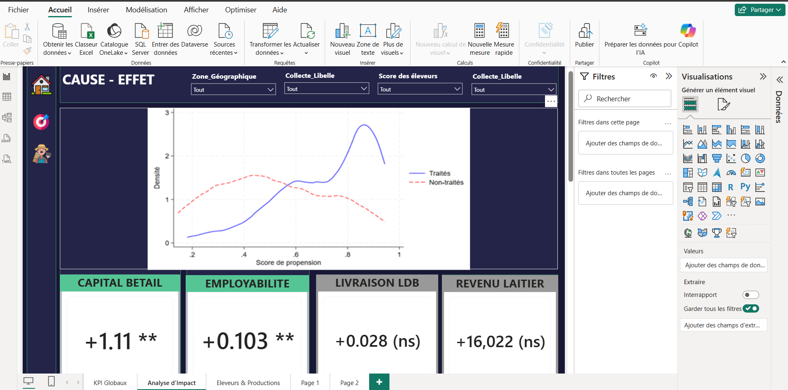
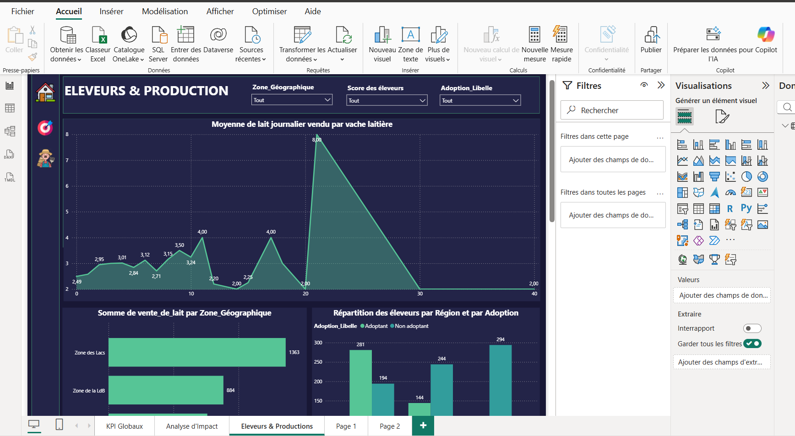

# Évaluation de l'Impact de l'Adoption du Mobile Money chez les Éleveurs Laitiers

Ce dépôt présente le tableau de bord Power BI développé dans le cadre de mon mémoire de stage, analysant l'impact causal du portefeuille numérique sur les comportements économiques des éleveurs.

##  Cascade de Sélection & Vue Globale

L'échantillon suit les étapes de sélection suivantes :
* **Échantillon total** : 1 208 éleveurs
* **Équipés en téléphone portable** : 864 éleveurs
* **Adoptants du Mobile Money** : 480 éleveurs
  
* ### ⚠️ Pourquoi le modèle de Heckman ?
Cette attrition successive montre que l'adoption du Mobile Money n'est pas aléatoire :
1. **Accès au téléphone** : Seuls les éleveurs possédant un téléphone portable peuvent accéder au service.
2. **Décision d'adoption** : Seule une partie des éleveurs équipés choisit d'adopter le Mobile Money.

Évaluer directement l'impact sur l'échantillon final (480 éleveurs) introduirait un **biais de sélection** (ou biais d'endogénéité) : les éleveurs équipés et adoptants possèdent des caractéristiques inobservables spécifiques (revenu, niveau d'instruction, accès aux infrastructures,...) qui influencent déjà leurs performances économiques.

Le **modèle de correction en deux étapes de Heckman** permet de :
* Modéliser la probabilité de sélection à chaque étape (*équation de sélection*).
* Corriger le biais dans l'estimation de l'impact causal réel du Mobile Money grâce au ratio de l'inverse de Mills (*équation d'intérêt*).
  

##  Résultats de l'Effet Causal (Méthode PSM - ATT)

###  Pourquoi compléter le PSM (Propensity Score Matching) ?

Alors que Heckman corrige le biais d'auto-sélection lié à la décision d'adoption, le **PSM** permet d'évaluer l'effet causal direct du Mobile Money en résolvant le problème du **contre-factuel**.

* **Création du groupe de contrôle** : Le PSM apparie chaque éleveur adoptant (groupe traité) avec un éleveur non-adoptant (groupe de contrôle) ayant un score de propension quasi identique, basé sur des caractéristiques observées similaires (taille du cheptel, âge, sexe, zone géographique...).
* **Isolation de l'effet (ATT)** : En comparant ces deux groupes équilibrés, on mesure l'**Effet Moyen du Traitement sur les Traités (ATT)**. Cela garantit que l'écart de performance constaté (ex. revenus, volume de lait vendu, taux d'employabilité...) est directement attribuable au Mobile Money, et non à d'autres facteurs socio-économiques.

Le modèle d'Appariement sur Score de Propension (PSM) et l'effet moyen du traitement sur les traités (ATT) mettent en évidence les impacts suivants :

###  Impacts Positifs & Significatifs
* **Capital Bétail (Stock de richesse)** : **+1.11 \*\*** (Significatif au seuil de 5%) — L'adoption favorise l'épargne sur pied et l'accumulation du cheptel.
* **Employabilité (Salarier des bergers)** : **+0.103 \*\*** (Significatif au seuil de 5%) — Augmentation de 10,3 points de la probabilité d'embaucher des bergers salariés.

###  Impacts Non Significatifs (Effets Neutres)
* **Revenu Laitier Courant** : **+16 022 FCFA (ns)** — Pas d'effet à court terme sur les gains financiers directs.
* **Livraison Laiterie (collecte_ldb)** : **+0.028 (ns)** — L'outil ne modifie pas la régularité des livraisons à la Laiterie du Berger.

##  Production et Ventes de Lait

## 🛠️ Outils utilisés pour corriger le biais de sélection et pour la PSM
* **Power BI Desktop** (Modélisation de données et Visualisation KPI)
* **DAX** (Création des mesures et filtres d'étapes)
* **Stata / R / 
